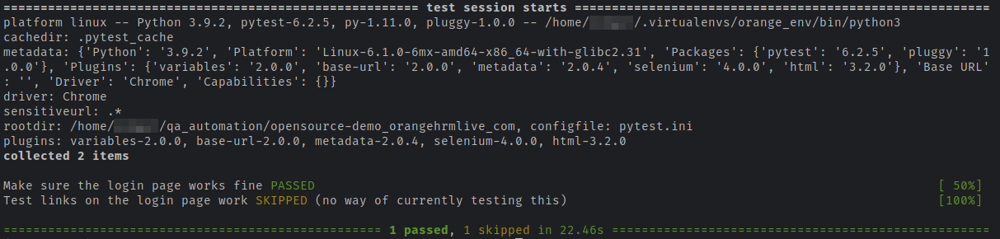

Introduction
------------

This repository contains basic example of usage PageObject
pattern with Selenium and Python (PyTest + Selenium).

Files
-----

[conftest.py](conftest.py) contains all the required code to catch failed test cases and make screenshot
of the page in case any test case will fail.

[Pages/base.py](pages/base.py) contains PageObject pattern implementation for Python.

[Pages/elements.py](pages/elements.py) contains helper class to define web elements on web pages.

[tests/test_login_opensource_demo.py](tests/test_login_opensource_demo.py) contains several Web UI tests for OrangeHRM (https://opensource-demo.orangehrmlive.com/)


How To Run Tests
----------------

1) Install all requirements:

    ```bash
    pip3 install -r requirements
    ```

2) Download Selenium WebDriver from https://chromedriver.chromium.org/downloads (choose version which is compatible with your browser)

3) Run tests:

    ```bash
    python3 -m pytest -v --driver Chrome --driver-path ~/chrome tests/*
    ```

   

Note:
~/chrome in this example is the file of Selenium WebDriver downloaded and unarchived on step #2.
